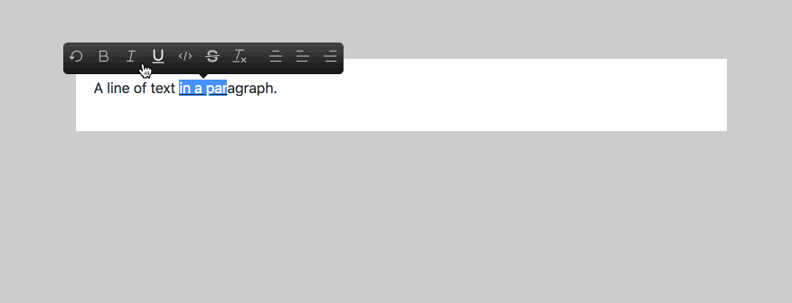

# slate-toolbar [![NPM version][npm-image]][npm-url] [![Build Status][travis-image]][travis-url] [![Dependency Status][daviddm-image]][daviddm-url]
> Quick and easy way to implement medium like toolbar in your [slate editor](https://docs.slatejs.org)



## Installation

```sh
$ npm install --save slate-toolbar
```

## Usage

`slate-toolbar` is the easiest way to implement a medium-like toolbar in your slate editor.

Just add a decorator `@toolbar()` on you editor component. The parent component of this component must pass two props `value: Value` and `onChange: (change: Change) => void`.

First add a new `<div id="slate-editor-toolbar"></div>` in your html, id `slate-editor-toolbar` is needed, we will need this to create a React portal in this DOM element. You could customize the id by passing `opt.toolbarElement`. 

```js
import toolbar from 'slate-toolbar';

@toolbar() // ----> Add this line and your toolbar is implemented in your editor
class EditorContainer extends React.Component<Props> {

  // On change, update the app's React state with the new editor state.
  render() {
    return (
      <div className="editor">
        <Editor
          value={this.props.value}
          onChange={this.props.onChange}
          renderMark={renderMark}
          renderNode={renderNode}
          plugins={plugins}
        />
      </div>
    );
  }
}

class App extends React.Component<{}, {value: Value}> {
  // Set the initial state when the app is first constructed.
  state = {
    value: initialValue
  }

  render() {
    return (
      <div className="container markdown-body">
        <EditorContainer
          value={this.state.value}
          onChange={({value}) => this.setState({value})}
        />
      </div>
    );
  }
}
```

see [./docs/index.js](./docs/index.js) for full implementation and demo

## Options

`slate-toolbar` is fully customizable, so it allows you to pass options to setup items you want to implement in your toolbar.

There's a example

```js
const options = {
  // default icons are Bold, Undo, Italic
  icons: [
    Undo,  // ----> this must be one of icon in https://github.com/Canner/slate-editor-icons#icon-packages
    Bold,
    Italic,
    Underline,
    Code,
    StrikeThrough,
    Clean,
    "divider",
    AlignCenter,
    AlignLeft,
    AlignRight
  ],
  // Which div do you want to create a React protal, default to "slate-editor-toolbar"
  toolbarElement: "my-toolbar-id"
};
```

## Start example server

```
npm start
```

## Maintainer

[chilijung](https://github.com/chilijung)

## License

MIT © [Canner](https://github.com/Canner)


[npm-image]: https://badge.fury.io/js/slate-toolbar.svg
[npm-url]: https://npmjs.org/package/slate-toolbar
[travis-image]: https://travis-ci.org/Canner/slate-toolbar.svg?branch=master
[travis-url]: https://travis-ci.org/Canner/slate-toolbar
[daviddm-image]: https://david-dm.org/Canner/slate-toolbar.svg?theme=shields.io
[daviddm-url]: https://david-dm.org/Canner/slate-toolbar
